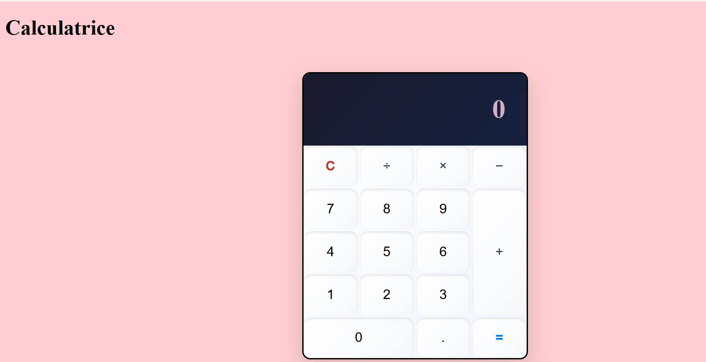

# 📱 Projet Calculatrice

Une calculatrice moderne et responsive réalisée avec **HTML**, **CSS** et **JavaScript**.  
Elle permet d'effectuer des opérations mathématiques de base (+, −, ×, ÷) avec une interface élégante.

---

## 🌟 Aperçu


 
---

## 📂 Structure du projet

```text
Projet-Calculatrice/
│
├── index.html      # Structure HTML principale
├── style.css       # Fichier CSS pour le design
├── script.js       # Logique JavaScript de la calculatrice
└── README.md       # Ce fichier


---

## 🚀 Fonctionnalités

✅ Interface moderne et responsive  
✅ Opérations : Addition, Soustraction, Multiplication, Division  
✅ Gestion des décimales et division par zéro (affiche "Erreur")  
✅ Bouton "C" pour réinitialiser l’écran  
✅ Animations sur les boutons (hover & active)

---

## 📦 Technologies utilisées

- **HTML5** : structure de la page
- **CSS3** : design avec grid layout et variables CSS
- **JavaScript** : logique et gestion des événements

---

## 💻 Utilisation

1️⃣ Cloner ou télécharger le projet.  
2️⃣ Ouvrir `index.html` dans un navigateur moderne.  
3️⃣ Utiliser la calculatrice :  
   - Taper les chiffres et opérateurs.  
   - Appuyer sur `=` pour calculer.  
   - Utiliser `C` pour tout effacer.

---

## 📱 Responsive Design

La calculatrice s’adapte automatiquement aux écrans mobiles et tablettes 📱.

---

## 👨‍💻 Auteur

- **Shadah HASSAN-ABDALLAH**
- Projet éducatif pour pratiquer HTML, CSS et JavaScript.

---
## 📌 Liens utiles

- 🔗 [Voir le projet sur GitHub](https://github.com/S-HASSAN-ABDALLAH/ProjetCalculatrice1)
- 🌐 [Tester la Calculatrice en ligne](https://shadahcalcul.netlify.app)


